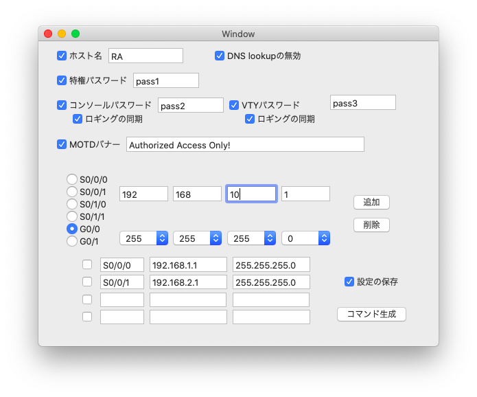
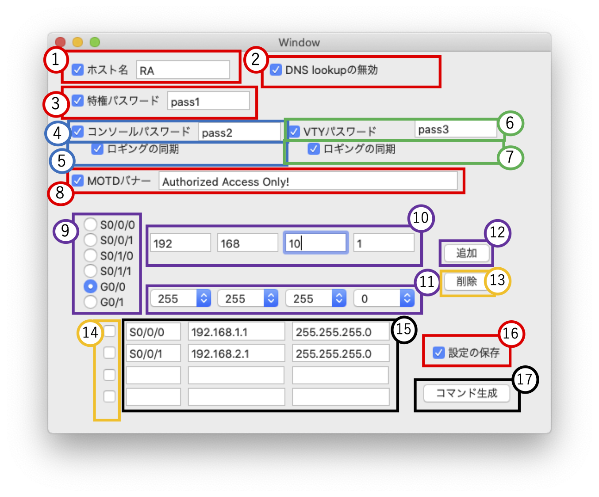
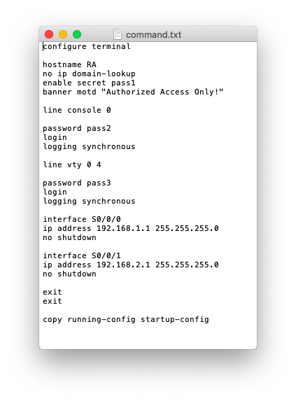

# Cisco-Command-Maker

Cisco-Command-MakerはCiscoルータの基本設定に使用するコマンドを、GUI上でパラメータを指定し、コマンドを生成するアプリケーションです。

動作環境はMAC OSです。

使用言語：C#言語
使用エディタ：VisualStudion、Xcode

# 設定画面
本アプリケーションは以下のようなGUI上で操作します。

各項目について説明していきます。

## 1　ホスト名
ここではホスト名を設定するコマンドが生成されます。チェックボックを入れ、パラメータを入力すると、以下のコマンドが生成されるようになります。

~~~
hostname RA
~~~

## 2　DNS lookupの無効
ここではドメイン名からの名前解決サービスを止めるコマンドが生成されます。チェックボックを入れると、以下のコマンドが生成されるようになります。

~~~
no ip domain-lookup
~~~

## 3　特権パスワード
ここでは特権EXECモードに移行する時のパスワードを設定するコマンドが生成されます。チェックボックを入れ、パラメータを入力すると、以下のコマンドが生成されるようになります。

~~~
enable secret pass1
~~~

## 4　コンソールパスワード
ここではコンソール接続時に使用するパスワードを設定するコマンドが生成されます。チェックボックを入れ、パラメータを入力すると、以下のコマンドが生成されるようになります。

~~~
line console 0
password pass2
login
~~~

## 5　ロギングの同期(コンソール接続)
ここではコンソール接続で、ログやデバッグの出力がコマンド入力を妨げる事を防ぐコマンドが生成されます。チェックボックを入れると、以下のコマンドが生成されるようになります。

~~~
line console 0
logging synchronous
~~~

## 6　VTYパスワード
ここではVTY接続時に使用するパスワードを設定するコマンドが生成されます。チェックボックを入れ、パラメータを入力すると、以下のコマンドが生成されるようになります。

~~~
line vty 0 4
password pass3
login
~~~

## 7　ロギングの同期(VTY接続)
ここではVTY接続で、ログやデバッグの出力がコマンド入力を妨げる事を防ぐコマンドが生成されます。チェックボックを入れると、以下のコマンドが生成されるようになります。

~~~
line vty 0 4
logging synchronous
~~~

## 8　MOTDバナー
ここではネットワーク機器接続時に表示されるバナーメッセージを設定するコマンドが生成されます。チェックボックを入れ、パラメータを入力すると、以下のコマンドが生成されるようになります。

~~~
banner motd "Authorized Access Only!"
~~~

## 9~12 IPアドレス
ここではインタフェースにIPアドレスを設定するコマンドが生成されます。
9でIPアドレスを設定するインタフェースを指定し、10でIPアドレス、11でサブネットマスクを指定し、12の追加ボタンを押下すると15のIPアドレスリストに追加されます。

15のIPアドレスリストが存在すると、以下のコマンドが生成されるようになります。

~~~
interface s0/0/0
ip address 192.168.1.1 255.255.255.0
no shutdown
~~~

### 13-14 IPアドレスの削除
---
ここではIPアドレスリストから、IPアドレスを削除することができます。
14で削除するIPアドレスを選択後、13の削除ボタンを押下するとIPアドレスが削除されます。

## 16 設定の保存
ここではネットワーク機器の設定を保存するためのコマンドが生成されます。チェックボックを入れると、以下のコマンドが生成されるようになります。

~~~
copy running-config startup-config
~~~

# コマンドの出力
17のコマンド生成ボタンを押下するとGUIの入力状態を元にコマンドが生成され、テキストファイルとして出力されます。テキストファイルはアプリケーションがあるディレクトリに「command.txt」として生成されます。

